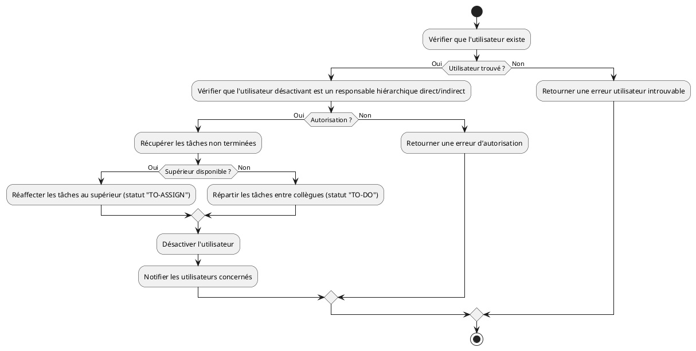

# **Spécifications Fonctionnelles Détaillées (SFD)**

---

## **1. Contexte du projet**

Cette application backend doit gérer les tâches pour les utilisateurs d'une entreprise. Elle permet notamment de créer, modifier et désactiver des utilisateurs et leurs tâches, tout en respectant des règles fonctionnelles strictes et en assurant une communication entre les différents acteurs via des notifications.

L'application est développée en **Java Spring Boot**, suivant une **architecture Hexagonale**, afin de garantir modularité et maintenabilité.

---

## **2. Règles de Gestion Fonctionnelles (RG-FCT)**

| **Identifiant** | **Règle**                                                                                                                                       | **Message d'erreur correspondant**                                                                                                                                                               |
|-----------------|-------------------------------------------------------------------------------------------------------------------------------------------------|--------------------------------------------------------------------------------------------------------------------------------------------------------------------------------------------------|
| **RGF-01**      | Un utilisateur peut être **responsable de plusieurs collègues**.                                                                                | N/A                                                                                                                                                                                              |
| **RGF-02**      | Un utilisateur possède un **supérieur hiérarchique (n+1)**.                                                                                     | N/A                                                                                                                                                                                              |
| **RGF-03**      | Un utilisateur peut être **affecté à plusieurs tâches**.                                                                                        | N/A                                                                                                                                                                                              |
| **RGF-04**      | Une tâche ne peut être affectée qu'à **un seul utilisateur**.                                                                                   | N/A                                                                                                                                                                                              |
| **RGF-05**      | Un utilisateur ne peut être **désactivé** que par un utilisateur de niveau hiérarchique supérieur.                                              | Vous n’êtes pas autorisé à désactiver cet utilisateur car vous n'êtes pas son responsable directement ou indirectement.                                                                          |
| **RGF-06**      | Lorsqu’un utilisateur est désactivé :                                                                                                           | N/A                                                                                                                                                                                              |
|                 | - Ses **tâches non terminées** sont réaffectées à son supérieur hiérarchique (`n+1`) et passent au statut **"TO-ASSIGN"**.                      | N/A                                                                                                                                                                                              |
|                 | - Si aucun supérieur n’est disponible, les tâches non terminées sont **réparties uniformément** entre ses collègues avec le statut **"TO-DO"**. | N/A                                                                                                                                                                                              |
| **RGF-07**      | Une notification est envoyée pour avertir les utilisateurs des **nouvelles tâches**.                                                            | N/A                                                                                                                                                                                              |
| **RGF-08**      | Une tâche contient :                                                                                                                            | N/A                                                                                                                                                                                              |
|                 | - Un **titre** : Obligatoire, maximum 50 caractères.                                                                                            | - Le titre de la tâche est obligatoire.   - Le titre de la tâche ne doit pas dépasser 50 caractères.                                                                                          |
|                 | - Une **description** : Facultative, maximum 1000 caractères.                                                                                   | N/A                                                                                                                                                                                              |
| **RGF-09**      | Les statuts possibles pour une tâche sont :                                                                                                     | - Le statut de la tâche est obligatoire.   - Le statut de la tâche peut prendre comme valeurs : « TO-DO », « IN-PROGRESS », « COMPLETED », « TO-ASSIGN ».                                     |
| **RGF-10**      | Le **nom** d’un utilisateur :                                                                                                                   | - Le nom du user est obligatoire.   - Le nom du user ne doit pas dépasser 255 caractères.                                                                                                     |
| **RGF-11**      | Le **prénom** d’un utilisateur :                                                                                                                | - Le prénom du user est obligatoire.   - Le prénom du user ne doit pas dépasser 120 caractères.                                                                                               |
| **RGF-12**      | Le **nom** et le **prénom** doivent contenir uniquement des caractères alphanumériques en majuscules, ainsi que les caractères « - » et « _ ».  | N/A                                                                                                                                                                                              |
| **RGF-13**      | Le **email** d'un utilisateur :                                                                                                                 | - Le email du user est obligatoire.   - Le email du user ne doit pas dépasser 255 caractères.    - Le email du user doit respecter le pattern suivant  **-->** NOM.Prenom@decathlon.com |

---

## **3. Règles de Gestion Techniques (RG-TCH)**

| **Identifiant** | **Règle**                                                                                                                                      |
|------------------|------------------------------------------------------------------------------------------------------------------------------------------------|
| **RGT-01**       | Les services sont exposés via une **API REST** conforme aux standards REST.                                                                   |
| **RGT-02**       | Gérer les réponses via des **codes HTTP** standards : **201** (Création), **200** (Succès), **400** (Données invalides), **404** (Non trouvé). |
| **RGT-03**       | L'application doit suivre une **architecture Hexagonale**, divisée en : **Domaine**, **Application**, et **Infrastructure**.                  |
| **RGT-04**       | Les règles métier doivent être isolées dans la couche **Domaine**, indépendantes des frameworks ou couches techniques (Spring, JPA, etc.).    |

---

## **4. Modèle de données**

### **Entité `User`**

| **Attribut** | **Type**     | **Contraintes**                                   |
|--------------|-------------|--------------------------------------------------|
| `id`         | Integer     | Clé primaire. Auto-généré.                       |
| `firstName`  | String      | Obligatoire, max 120 caractères.                 |
| `lastName`   | String      | Obligatoire, max 255 caractères.                 |
| `email`      | String      | Obligatoire, max 255 caractères.                 |
| `managerId`  | Integer     | Clé étrangère vers `User`.                       |
| `active`     | Boolean     | Par défaut `true`.                               |

---

### **Entité `Task`**

| **Attribut**  | **Type**     | **Contraintes**                                   |
|---------------|-------------|--------------------------------------------------|
| `id`          | Integer     | Clé primaire. Auto-généré.                       |
| `title`       | String      | Obligatoire, max 50 caractères.                  |
| `description` | String      | Facultatif, max 1000 caractères.                 |
| `status`      | Enum        | Obligatoire. Valeurs possibles : `TO-DO`, `IN-PROGRESS`, `COMPLETED`, `TO-ASSIGN`. |
| `userId`      | Integer     | Obligatoire. Clé étrangère vers `User`.   

---

## **5. Cas d'utilisation**

| **ID**  | **Titre**                                | **Description**                                                                                                              |
|---------|------------------------------------------|------------------------------------------------------------------------------------------------------------------------------|
| **CU-01** | **Créer un utilisateur**                 | Ajouter un utilisateur dans le système avec un rôle, un nom, un prénom et un supérieur hiérarchique.                        |
| **CU-02** | **Créer une tâche**                      | Créer une tâche avec un titre, une description, et l’associer à un utilisateur.                                              |
| **CU-03** | **Un collaborateur quitte l'entreprise** | Réattribuer les tâches non terminées, mettre à jour les statuts et notifier les utilisateurs concernés.                      |

---

## **6. Diagramme d'activité : Désactivation d'un utilisateur**

[Site PlantUML](https://www.planttext.com/)

Ce diagramme détaille l’ensemble des étapes pour désactiver un utilisateur, vérifier les droits de l’action et réaffecter les tâches en fonction des règles métier définies.