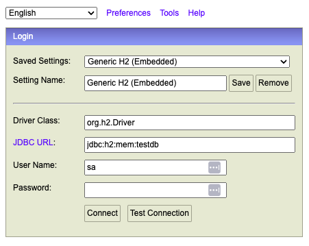
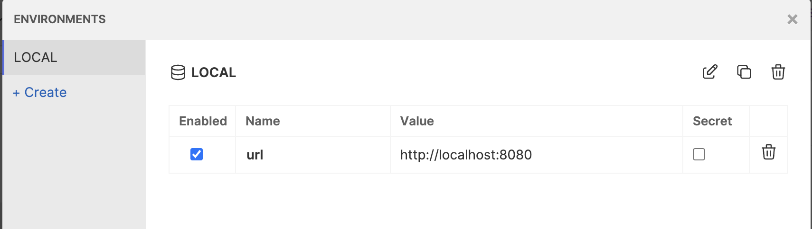

# POC Hexagonal Architecture

This is a simple POC of a REST API using the Hexagonal Architecture.

## Pre-requisites
- Java 23 (https://jdk.java.net/23/)
- Maven 3
- Bruno (https://www.usebruno.com/downloads)
- Your IDE of choice (IntelliJ, Eclipse, etc.)

## Running the API

After starting the server, you can check if the api is running by accessing the following url :
- http://localhost:8080/actuator/health

You can access the database via :
- http://localhost:8080/h2-console
using the following credentials:
- JDBC URL: jdbc:h2:mem:testdb
- User Name: sa
- Password: password

You can also test the api using these examples :
- http://localhost:8080/users
- http://localhost:8080/users/1
- http://localhost:8080/users/99
- http://localhost:8080/users/1/tasks/2

## Testing the API

### Using a workspace

To use the Bruno requests, you have to import the following project to your bruno workspace :
- [poc-hexa-archi-bruno-workspace](poc-hexa-archi-bruno-workspace)

Then, you can choose the **LOCAL** environment variables :
- 

### Using a collection

You can also use this bruno exported collection to test the API :
- [poc-hexa-archi-bruno-workspace.json](src/main/resources/bruno/poc-hexa-archi-bruno-workspace.json)

You have also to create and configure this **LOCAL** environment variables in Bruno :
- 

